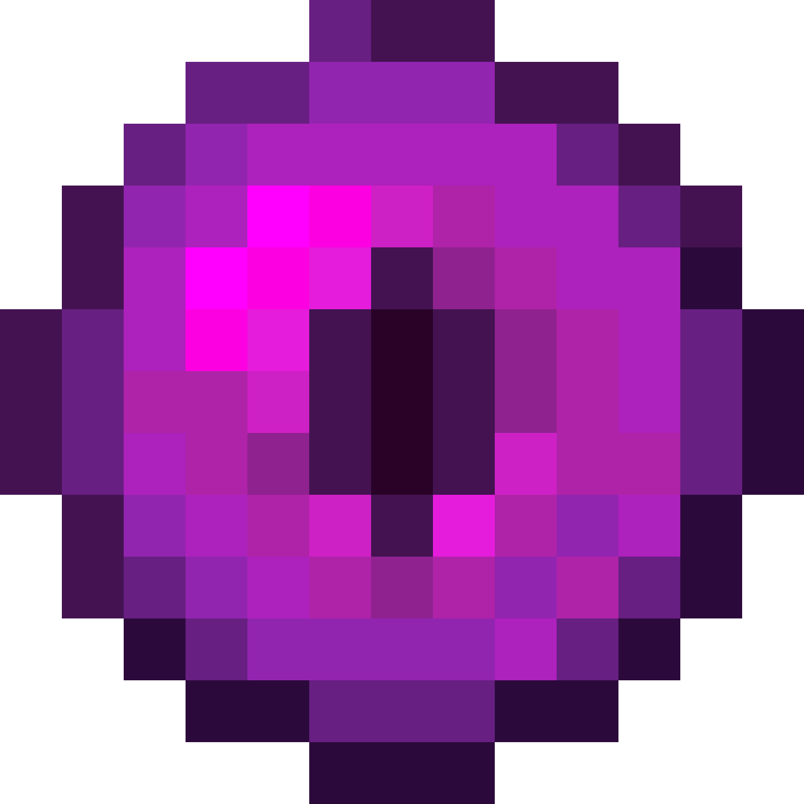

  

# End - A VS Code Theme Inspired by Minecraft’s The End  

**Step into *The End* and code in the void!** ✨ This theme draws inspiration from Minecraft’s The End, blending mysterious purples, fiery energy crystals, and the eerie gaze of Endermen into your editor.  

## 🎨 Color Scheme

| Color Code  | Origin Story                          |
|------------|-----------------------------------|
| `#161616`  | The void-like face of an Enderman 👁️‍🗨️ |
| `#f8eeff`  | The pale top of a Chorus Flower 🌸  |
| `#ff1155`  | The explosive core of an End Crystal 💥 |
| `#ee7722`  | The flickering orange of End Fire 🔥 |
| `#eeeeaa`  | The ancient hue of End Stone � |
| `#aadd00`  | The glowing green of an Eye of Ender 💚 |
| `#00ccbb`  | The quantum shimmer of an Ender Pearl 📡 |
| `#00ddff`  | The icy glow of an Enchanted Diamond Sword ❄️ |
| `#e55fff`  | The eerie purple of an Enderman’s eyes 👾 |
| `#ff55ee`  | The pulsing energy of an End Crystal 🌈 |
| `#cc00ff`  | The menacing gaze of the Ender Dragon 🐉 |

> 🔮 **Color Easter Egg**: All HEX values follow a symmetric `aabbcc` pattern, mirroring the perfect geometry of an End Portal!  

## ⚡ Core Features  

### 1. **Accessibility-First** 🦮  
   - Compliant with **WCAG 2.1 AA** standards:  
     - Text contrast ≥ 4.5:1 (normal text)  
     - Critical syntax (e.g., errors) ≥ 7:1 (e.g., `#ff1155` for warnings)  

### 2. **Scientifically Crafted** 🧪  
   - Uses **HSLuv color space** for perceptual uniformity  
   - High-energy colors optically optimized to reduce eye strain  

### 3. **Geek Aesthetics** 🤖  
   - Symmetric HEX code elegance (e.g., `#cc00ff`)  
   - Terminal-friendly: Accurate ANSI 16-color mapping  

## 🛠️Installation

1. Search for **"End"** in the VS Code Marketplace  
2. Or manually install via `.vsix`  

## 🎨Acknowledgments

This theme was initially generated using [themer](https://themer.dev/) and then meticulously customized to capture the essence of Minecraft’s End. Special thanks to the themer team for the foundational tool!  

## 📜 License

MIT License - Free as an Enderman’s teleport!  

> *"True adventurers, the code is their end ship."*

